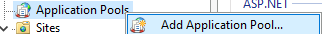
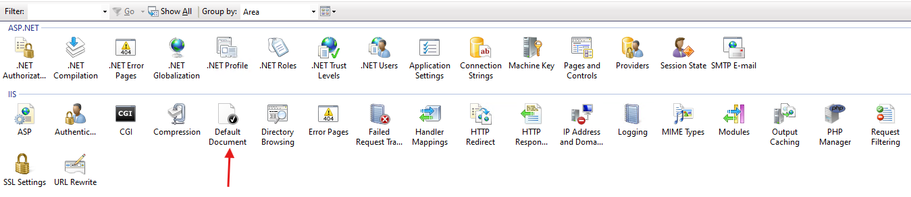
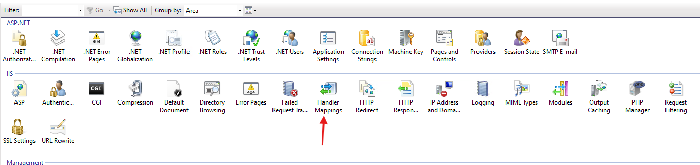

# CONFIGURATION QNAP IIS

## Description

This project has been developed using Laravel v11.28.1 and PHP v8.3.6 with the aim of providing a detailed guide on setting up a QNAP NAS for efficient file and folder management. The application will be deployed on IIS (Internet Information Services) and focuses on the proper configuration of the IIS environment, as well as potential errors that may arise during the process.

This guide is designed to assist those looking to implement a file management system using a QNAP NAS, addressing key aspects such as installation, permission configuration, and troubleshooting common issues that may occur in IIS.

The purpose of this documentation is to help users understand and manage their NAS, enabling them to optimize its use and ensuring they can effectively overcome technical challenges. With this guide, I aim to provide a valuable resource that supports the community in their journey towards the successful implementation of a cloud-based file management system.

Additionally, Swagger has been implemented in the application, allowing users to explore and visualize the API configuration directly in the respective code. This offers an interactive way to understand the available routes and methods, making it easier for those who wish to dive deeper into the API's setup.

## Tabla de Contenidos

1. [Description](#description)
2. [Requisitos previos](#prerequisites)
3. [Creación del Proyecto Laravel](#creating-the-laravel-project)
4. [Uso de Git](#using-git)
5. [Configuración del Entorno](#environment-setup)
    - [Instalación de Dependencias](#1-installing-dependencies)
    - [Configuración archivo .ini](#2-configuring-the-ini-file)
    - [Creación del Archivo .env](#3-creating-the-env-file)
    - [Generación de APP_KEY](#4-generating-app_key)
6. [Configuración de IIS](#iis-configuration)
    - [Configuración de web.config](#what-is-webconfig)
    - [Creación de un Pool de Aplicaciones](#what-is-an-application-pool-in-iis)
    - [Creación de un Nuevo Sitio Web](#configuring-the-new-website)
7. [Configuración del Document Default](#configuring-the-default-document)
8. [Handler Mapping](#handler-mapping-configuration)
9. [Configuración de Hosts y Dominio](#hosts-and-domain-configuration)
10. [Acceso a la aplicación](#accessing-the-application)
11. [Resolución de Problemas](#troubleshooting)
    - [DNS_PROBE_FINISHED_NXDOMAIN](#1-dns_probe_finished_nxdomain)
    - [Failed to open stream: Permission denied](#2-storageframeworkviews2a6b197af13a60869ebf5cbe9f5f7eafphp-failed-to-open-stream-permission-denied)
    - [Curl error. Failed to connect yourDomain](#3-curl-error-failed-to-connect-yourdomain-port-xxx-after-21021-ms-couldnt-connect-to-server)
12. [Solucion de problemas](#troubleshooting-solutions)
    - [DNS_PROBE_FINISHED_NXDOMAIN SOLUTION](#1-dns_probe_finished_nxdomain-solution)
    -   [Failed to open stream: Permission denied SOLUTION](#2-failed-to-open-stream-permission-denied-solution)
    -   [Failed to connect to yourDomain port xxx after 21021 ms SOLUTION](#3-failed-to-connect-to-yourdomain-port-xxx-after-21021-ms-solution)

13. [Swagger](#swagger)
14. [Conclusiones](#conclusions)

### Prerequisites

Before starting this project or any similar one, it is important to ensure that the following tools and technologies are properly installed and configured

1. **[PHP](https://www.php.net/)**: This is the programming language used by Laravel. Make sure you have a version compatible with Laravel installed to run the project correctly.

2. **[Composer](https://getcomposer.org/)**: Composer is a dependency manager for PHP. Laravel relies on Composer to manage packages and libraries, so having it installed is crucial before getting started.

3. **[IIS (Internet Information Services)](https://learn.microsoft.com/es-es/iis/get-started/introduction-to-iis/iis-web-server-overview)**: This is Microsoft’s web server used to host the Laravel application in this project. It’s essential to configure it properly for your application to function correctly.

4. **[Visual Studio Code (Opcional)](https://code.visualstudio.com/)**: A lightweight and powerful code editor, recommended for writing and editing PHP code and other configuration files. Although optional, it can greatly simplify the development and configuration process.

5. **[WinCache Extension for PHP (Opcional)](https://sourceforge.net/projects/wincache/)**: This is a caching module specifically optimized for Windows environments. Its main purpose is to enhance the performance of PHP applications by caching PHP scripts.

6. **[IIS URL Rewrite (Opcional)](https://www.iis.net/downloads/microsoft/url-rewrite)**: This tool allows web administrators to create effective rules to implement URLs that are easier for users to remember and for search engines to find.

## Creating the Laravel Project

[Laravel](https://laravel.com/) is a modern and robust PHP framework designed to simplify web application development, including REST APIs, using an elegant and expressive syntax. It is widely used due to its focus on simplicity, security, and fast development.
For more details on how to create a Laravel project from scratch, you can consult the [official documentation.](https://laravel.com/docs/11.x). This guide provides step-by-step instructions on installing Laravel and configuring your development environment, allowing you to start developing your application efficiently.

In this project, Laravel was used to create a **API REST** that enables the management and consumption of services for the **QNAP NAS** system according to its [official documentation.](https://download.qnap.com/dev/QNAP_QTS_File_Station_API_v5.pdf) with a few adjustments. Throughout this document, we will explore how the API was developed and configured to meet the specific requirements of this environment.

## Using Git

You can download this project using the following command.

```bash
git clone https://github.com/Deivid30Medina/qnap-example-api.git
```

## Environment Setup

Once you have downloaded the project using `git clone`, follow these steps to properly configure the environment:

### 1. Installing `Dependencies`

-   Navigate to the project directory where you ran `git clone` and execute the following command to install all the necessary dependencies:

    ```bash
    composer install
    ```

### 2. Configuring the `.ini` file

Remember that certain extensions must also be enabled in the `php.ini` file, specifically:

-   Ensure that the `extension_dir` directive is set to `"ext"`.

-   Uncomment (remove the `;` at the beginning of the line) any necessary extensions, such as:

    -   `php_curl.dll`
    -   `php_gettext.dll`
    -   `php_mysqli.dll`
    -   `php_mbstring.dll`
    -   `php_gd.dll`
    -   `php_fileinfo.dll`
    -   `php_pdo_mysql.dll`
    -   `php_pdo_pgsql.dll`
    -   `php_pgsql.dll`
    -   `php_intl.dll`

Enabling these extensions is crucial to ensure your Laravel application functions properly, as they provide essential features for database connections, string handling, and more.

### 3. Creating the `.env` File

Laravel uses a `.env` file to manage the project’s environment variables. You need to create this file in the root of the project by copying the contents of the `.env.example` file that comes with Laravel by default.

Here is an example configuration for the `.env` file with the necessary variables for this project:

    ```env
    APP_NAME=Laravel
    APP_ENV=local
    APP_KEY=
    APP_DEBUG=true
    APP_URL=http://localhost

    LOG_CHANNEL=stack

    DB_CONNECTION=mysql
    DB_HOST=127.0.0.1
    DB_PORT=3306
    DB_DATABASE=laravel
    DB_USERNAME=root
    DB_PASSWORD=

    CACHE_DRIVER=file
    QUEUE_CONNECTION=sync
    SESSION_DRIVER=file
    SESSION_LIFETIME=120

    NAS_URL_QNAP=https://yourDomine.com/cgi-bin
    L5_SWAGGER_GENERATE_ALWAYS=true
    ```

    Las dos últimas variables son específicas de este proyecto y permiten:

    - `NAS_URL_QNAP`: Definir la URL del sistema **QNAP** que se utilizará para consumir sus servicios.

    - `L5_SWAGGER_GENERATE_ALWAYS`: Forzar la regeneración de la documentación de **Swagger** automáticamente.

### 4. Generating `APP_KEY`

After configuring the `.env` file, you need to generate the application key, which is used to encrypt data and secure the system. To do this, run the following command:

    ```bash
    php artisan key:generate
    ```

This command will update the `APP_KEY` variable with a unique and secure value in your `.env` file.

## IIS Configuration

In this project, the `public` folder is the one we will use to create a new website in IIS. It is important to place the `web.config` file inside this folder. If you prefer to store the `web.config` file in another location, you can do so, but you will need to adjust the settings accordingly.

### What is `web.config`

The `web.config` file is crucial for configuring URL rewriting, controller mappings, and other settings necessary for your Laravel project to function properly on IIS. It allows IIS to manage routing and direct requests to the correct resources. Without it, Laravel’s routing system would not work as expected, especially when handling friendly URLs and dynamic routes.

Here is an example `web.config` file for this project:

```xml
<?xml version="1.0" encoding="UTF-8"?>
<configuration>
    <system.webServer>
        <rewrite>
            <rules>

                <!--
                Rule 1: Remove trailing '/' from the URL
                This rule ensures that URLs ending with a slash are redirected to the same URL without the trailing slash.
                Example: /example/ becomes /example
                -->
                <rule name="RewriteRequestsToPublic">
                    <match url="^(.*)/$" />
                    <conditions logicalGrouping="MatchAll" trackAllCaptures="false">
                        <add input="{REQUEST_FILENAME}" matchType="IsFile" negate="true" />
                        <add input="{REQUEST_FILENAME}" matchType="IsDirectory" negate="true" />
                    </conditions>
                    <action type="Redirect" redirectType="Permanent" url="{R:1}" />
                </rule>

                <!--
                Rule 2: Rewrite request if the file or directory does not exist.
                If a requested file or directory doesn't exist, the request will be rewritten to go through "index.php".
                This is useful for routing systems in frameworks like Laravel that rely on friendly URLs.
                -->
                <rule name="Imported Rule 1" stopProcessing="true">
                    <match url="^(.*)$" ignoreCase="true" />
                    <conditions logicalGrouping="MatchAll">
                        <add input="{REQUEST_FILENAME}" matchType="IsDirectory" negate="true" />
                        <add input="{REQUEST_FILENAME}" matchType="IsFile" negate="true" />
                    </conditions>
                    <action type="Rewrite" url="index.php/{R:1}" appendQueryString="true" />
                </rule>

            </rules>
        </rewrite>
        <handlers>
            <add name="PHP 8.2.24" path="*.php" verb="*" modules="FastCgiModule" scriptProcessor="C:\php-8.2.24\php-cgi.exe" resourceType="File" />
        </handlers>
    </system.webServer>
</configuration>

```

### What is an Application Pool in IIS

An **Application Pool** in IIS is a configuration that allows you to isolate different applications running on the server. It’s important because it helps manage the resources each application uses and enhances security by keeping the applications independent from one another. Each pool runs under a specific identity, allowing you to control how each web application accesses system resources.

### Steps to Create a New Application Pool

**Creating a New Application Pool**: Open the IIS Manager and click on the **Application Pools** section. To create a new pool, follow these steps:

1. Click on **Add Application Pool** on the right-hand side.

    

2. Provide a name for the pool (e.g., "qnap-example").

    

3. Set the **.NET CLR Version** to **No Managed Code**.

4. Ensure the option **Start application pool immediately** is checked.

### Configuring the New Website

After configuring the pool, the next step is to create the new website in IIS:

1. Right-click on **Sites** in IIS Manager and select **Add Website**.

    

2. Choose the **Application Pool** you created earlier.

    

3. Set the **physical path** to the `public` folder of your Laravel project.

**Selecting the Public Folder**: In the **Physical Path** section, browse for the `public` folder of your Laravel project.


**Finalizing Configuration**: Once all configurations are complete, click **OK** or **Apply** to finalize and create the new website.

You should now see the newly created website in IIS Manager.

## Configuring the Default Document

The **Default Document** in IIS is a critical configuration that defines the default file that will load when a user accesses a URL without specifying a concrete file. For example, when someone visits `http://yourdomain.com/`, the server needs to know which file to serve by default, and this is where the Default Document comes into play.

### Why is it important?

Configuring the Default Document correctly ensures that the web server delivers the right page to visitors, avoiding 404 errors or navigation issues. If a start file (such as `index.php` or `Default.php`) isn’t specified, IIS might not know which file to load and will return an error.

### Files to configure

For a Laravel project, it is crucial to configure the following files as defaults in IIS’s Default Document settings:

-   **index.php**: Laravel uses `index.php` as the entry point for most HTTP requests. All routes and controllers in your application are processed through this file.

-   **Default.php**: Although Laravel doesn’t directly use `Default.php`, it’s good practice to add it as a fallback, as some servers might look for this file if `index.php` isn’t properly configured.

### How to Configure It?

1. In the IIS Manager, select the website you just created.

2. Click on **Default Document** in the center of the window.

    

3. Ensure that `index.php` and `Default.php` are listed as default documents.

4. If any of these are not present, click **Add** and add them manually.

    

This will ensure that the web server loads your application correctly when a user accesses your site without specifying a page.

## Handler Mapping Configuration

**Handler Mapping** in IIS is a configuration that tells the server how to process certain types of files, such as `.php` files. This is essential for requests involving PHP scripts to be correctly forwarded to the appropriate processor (in this case, PHP), allowing the server to execute the code and return the result to the client.

### Why is it important?

Configuring the Handler Mapping is critical for IIS to properly handle and process PHP files. Without this configuration, the server will not be able to execute PHP code and will return errors when attempting to access PHP scripts.

### Steps to Validate and Configure the Handler Mapping for PHP

1. **Verifying the Existing Handler**:

    - Before creating a new handler, first, we need to check if one is already configured for PHP.
    - In IIS, select your website and navigate to the **Handler Mappings** option.

        

    - Look for a handler associated with **PHP**. If you find one, make sure it points to the correct PHP version installed on your system.

    - To verify the PHP version on your system, you can run the following command in the command line:

        ```bash
        php -v
        ```

    - If the version does not match the one installed or if the handler is misconfigured, delete it to avoid conflicts.

2. **Adding a New Handler for PHP**:

    - If you do not have a handler configured for PHP, follow these steps to add a new one:

        

        1. In **Handler Mappings**, select **Add Module Mapping**.

            

        2. In the **Request Path** field, enter `*.php` to indicate that this handler should process all `.php` files.

        3. In **Module**, select **FastCgiModule**.

            

        4. In **Executable**, find and select the `php-cgi.exe` file, which is typically located in the directory where your PHP version is installed (e.g., `C:\php-8.3.6\php-cgi.exe`).

            

        5. In **Name**, enter a descriptive name like `PHP 8.3.6` to identify the PHP version you are configuring.

            

3. **Confirmation and Validation**:

    - Once you have completed the steps above, click **OK** and confirm again when prompted.

        

    - Verify that the new handler has been added correctly in the **Handler Mappings** list.

        

    - You can check if it is working correctly by testing the execution of a PHP script on your site.

With this proper configuration, you ensure that IIS handles and correctly executes PHP files in your application.

## Hosts and Domain Configuration

If you do not have an acquired domain, you can configure your system's `hosts` file to simulate a local domain. This file allows your computer to associate a domain name with a specific IP address, making it easier to access your development application through a name instead of using the IP address directly.

### Steps to Configure the hosts File:

1. **Open the hosts file**:

    - On Windows, the file is located at `C:\Windows\System32\drivers\etc\hosts`.
    - You can open it with a text editor like Notepad. Make sure to run it as an administrator to have write permissions.

        

2. **Add the domain**:

    - At the end of the file, add a line in the following format:

        ```
        127.0.0.1    yourDomain.com
        ```

    - Replace `yourDomain.com` with the domain you want to use for your application.

        

3. **Save the changes**:

    - After adding the line, save the file. If you are using a text editor like Notepad, you may need to select "All Files" in the file type box to save it correctly.

### Accessing the Application

Once you have configured the `hosts` file, you will be able to access your application through the domain you specified in your browser, using the URL `http://yourDomain.com`. This will allow you to test your application as if you were using a real domain, facilitating the development and testing process.

With this configuration, you can simulate access to your application as if you were using a real domain, which is especially useful during development.


## Troubleshooting

This section describes some common errors that may arise during the configuration and execution of your Laravel application on IIS.

### 1. `DNS_PROBE_FINISHED_NXDOMAIN`

This error indicates that the domain you are trying to access cannot be resolved to an IP address. This often occurs when the domain is not properly configured in the `hosts` file or has not propagated in the DNS system.

**Solution**: For more details on how to resolve this issue, refer to the section [Solutions for DNS_PROBE_FINISHED_NXDOMAIN](#solutions-for-dns_probe_finished_nxdomain).


### 2. `\storage\framework\views/2a6b197af13a60869ebf5cbe9f5f7eaf.php: Failed to open stream: Permission denied`

This error suggests that the web server does not have the appropriate permissions to access files in the Laravel storage folder.


**Solution**: You can find more information on how to resolve permission issues in the section [Solutions for Permissions in Laravel](#solutions-for-permissions-in-laravel).

### 3. `Curl error. Failed to connect yourDomain port xxx after 21021 ms: Couldn't connect to server.`

This error occurs when the application cannot establish a connection with the QNAP server. It may be due to various factors, such as an incorrect port, an inaccessible QNAP server, or network issues.


**Solution**: For more information on how to resolve this issue, visit the section [Solutions for Connection Issues with QNAP](#solutions-for-connection-issues-with-qnap).

## Troubleshooting Solutions

### 1. DNS_PROBE_FINISHED_NXDOMAIN SOLUTION

This error indicates that the domain you are trying to access cannot be resolved to an IP address. This can occur for several reasons, such as incorrect DNS configuration or the domain not being properly defined. To resolve this issue:

-   **Modify the hosts file:**

    -   Open the `hosts` file on your system. On Windows, it is located at `C:\Windows\System32\drivers\etc\hosts`. Make sure to open it with administrative privileges.

    -   Add a line with the corresponding IP address and the domain you are using. For example:

        ```
        192.168.1.1   yourDomain.com
        ```

    -   Save the changes and restart your browser.

### 2. Failed to open stream: Permission denied SOLUTION

This error is related to access permissions for the files and folders of your Laravel application. Laravel stores logs, cache, and other temporary files in the `storage` folder, and it is crucial that the IIS users have the appropriate permissions to access these files.

-   **Understanding permissions:**

    -   When IIS handles requests, it operates under a specific user (such as `IIS_IUSRS` on Windows), which needs to have access to the folders where Laravel stores data.

    -   You must ensure that the `storage` folder and its subfolders have adequate permissions. It is recommended to grant at least read and write permissions to the IIS user.

-   **Setting permissions:**

    -   Right-click on the `storage` folder, select "Properties," and then go to the "Security" tab.

    -   Ensure that the `IIS_IUSRS` group has read and write permissions enabled.

-   **Importance of permissions:**

    -   If the permissions are not configured correctly, Laravel will not be able to create logs or store cache, which may lead to errors in your application execution.


### 3. Failed to connect to yourDomain port xxx after 21021 ms SOLUTION

This error indicates that your server could not establish a connection with the specified domain. It may be caused by network issues or security configurations.

-   **Check outbound permissions:**

    -   Ensure that your server has permission to make outgoing requests to the internet. This may include configurations in the firewall or security software running on the server.

-   **Configurations on the NAS:**

    -   Verify that the NAS is configured to accept requests from different geographic locations. If your server is located in a different country (for example, if your NAS only allows connections from Colombia), you will need to adjust the security settings to permit requests from your server.

By following these steps, you may be able to resolve the most common issues that can arise when configuring your Laravel application in an IIS environment.

## Swagger

Swagger is a powerful tool that allows you to document and test APIs interactively. With Swagger, you can perform various tests according to the endpoints defined in your Laravel application. To access the Swagger documentation, once you have published your project on IIS, or if you are running the server locally with `php artisan serve`, simply navigate to the following URL: `/api/documentation`.

From this interface, you will be able to explore all available endpoints, conduct tests by sending requests, and view the responses in real-time. Additionally, if you wish to add more endpoints or modify the existing documentation, you can easily do so through the Swagger configuration in your project.

## Conclusions

The aim of this repository is to assist those facing issues with daily configurations in Laravel and IIS. While not all possible errors are covered, those that have personally presented the greatest challenges when searching for applicable solutions for my project have been included.

I appreciate any help or feedback that can be provided to improve this resource and facilitate the configuration and use of Laravel in IIS environments.
