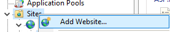
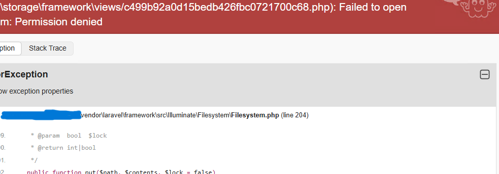
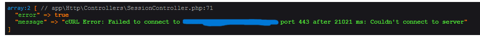

# CONFIGURACIÓN QNAP IIS

## Descripción

Este proyecto se ha desarrollado utilizando Laravel v11.28.1 y PHP v8.3.6 con el objetivo de proporcionar una guía detallada sobre la configuración de un QNAP NAS para la gestión eficiente de archivos y carpetas. La aplicación se desplegará en IIS (Internet Information Services) y se centrará en la configuración adecuada del entorno IIS, así como en los posibles errores que pueden surgir durante este proceso.

La guía está diseñada para ayudar a aquellos que buscan implementar un sistema de gestión de archivos utilizando un QNAP, abordando aspectos clave como la instalación, la configuración de permisos y la resolución de problemas comunes que pueden presentarse en IIS.

El propósito de esta documentación es facilitar a los usuarios la comprensión y el manejo de su NAS, permitiéndoles optimizar su uso y asegurando que puedan superar obstáculos técnicos de manera efectiva. Con esta guía, espero brindar un recurso útil que apoye a la comunidad en su camino hacia la implementación exitosa de un sistema de gestión de archivos en la nube.

Además, se ha implementado Swagger en la aplicación, lo que permite a los usuarios explorar y visualizar la configuración de la API directamente en el código respectivo. Esto proporciona una forma interactiva de entender las rutas y los métodos disponibles, facilitando el trabajo con la API para quienes deseen profundizar en su configuración.


## Tabla de Contenido

## Tabla de Contenidos
1. [Descripción](#descripción)
2. [Requisitos previos](#requisitos-previos)
3. [Creación del Proyecto Laravel](#creación-del-proyecto-laravel)
4. [Uso de Git](#uso-de-git)
5. [Configuración del Entorno](#configuración-del-entorno)
    - [Instalación de Dependencias](#1-instalación-de-dependencias)
    - [Configuración archivo .ini](#2-configuración-archivo-ini)
    - [Creación del Archivo .env](#3-creación-del-archivo-env)
    - [Generación de APP_KEY](#4-generación-de-app_key)
6. [Configuración de IIS](#configuración-de-iis)
    - [Configuración de web.config](#qué-es-webconfig)
    - [Creación de un Pool de Aplicaciones](#qué-es-un-grupo-de-aplicaciones-en-iis)
    - [Creación de un Nuevo Sitio Web](#configuración-del-nuevo-sitio-web)
7. [Configuración del Document Default](#configuración-del-document-default)
8. [Handler Mapping](#manejo-de-mapeo-de-controladores-handler-mapping)
9. [Configuración de Hosts y Dominio](#configuración-de-hosts-y-dominio)
10. [Acceso a la aplicación](#acceso-a-la-aplicación)
11. [Resolución de Problemas](#resolución-de-problemas)
    - [DNS_PROBE_FINISHED_NXDOMAIN](#1-dns_probe_finished_nxdomain)
    - [Failed to open stream: Permission denied](#2-storageframeworkviews2a6b197af13a60869ebf5cbe9f5f7eafphp-failed-to-open-stream-permission-denied)
    - [Curl error. Failed to connect yourDomain](#3-curl-error-failed-to-connect-yourdomain-port-xxx-after-21021-ms-couldnt-connect-to-server)
12. [Solucion de problemas](#solución-de-problemas)
    - [DNS_PROBE_FINISHED_NXDOMAIN](#1-dns_probe_finished_nxdomain-soluction)
    - [Failed to open stream: Permission denied](#2-failed-to-open-stream-permission-denied-soluction)
    - [Curl error. Failed to connect yourDomain](#3-failed-to-connect-to-yourdomain-port-xxx-after-21021-ms-soluction)
13. [Swagger](#swagger)
14. [Conclusiones](#conclusiones)


### Requisitos Previos

Antes de comenzar con este proyecto o cualquier otro similar, es importante asegurarse de que las siguientes herramientas y tecnologías estén instaladas y configuradas correctamente:

1. **[PHP](https://www.php.net/)**: Es el lenguaje de programación utilizado por Laravel. Asegúrate de tener instalada una versión compatible con Laravel para ejecutar el proyecto correctamente.
   
2. **[Composer](https://getcomposer.org/)**: Es un gestor de dependencias para PHP. Laravel depende de Composer para gestionar paquetes y librerías, por lo que es fundamental tenerlo instalado antes de empezar.

3. **[IIS (Internet Information Services)](https://learn.microsoft.com/es-es/iis/get-started/introduction-to-iis/iis-web-server-overview)**: Es el servidor web de Microsoft utilizado para alojar la aplicación Laravel en este proyecto. Es crucial configurarlo adecuadamente para que tu aplicación funcione correctamente.

4. **[Visual Studio Code (Opcional)](https://code.visualstudio.com/)**: Es un editor de código ligero y poderoso, recomendado para escribir y editar código PHP y otros archivos de configuración. Aunque es opcional, puede facilitar mucho el proceso de desarrollo y configuración.

5. **[WinCache Extension for PHP (Opcional)](https://sourceforge.net/projects/wincache/)**: Módulo de caché optimizado específicamente para entornos Windows. Su propósito principal es mejorar el rendimiento de las aplicaciones PHP al almacenar en caché los scripts PHP.

6. **[IIS URL Rewrite (Opcional)](https://www.iis.net/downloads/microsoft/url-rewrite)**: Permite a los administradores web crear reglas eficaces para implementar direcciones URL que sean más fáciles de recordar para los usuarios y de encontrar para los motores de búsqueda.


## Creación del Proyecto Laravel

[Laravel](https://laravel.com/) es un framework de PHP moderno y robusto, diseñado para facilitar el desarrollo de aplicaciones web, incluyendo APIs REST, mediante una sintaxis elegante y expresiva. Es ampliamente utilizado por su enfoque en la simplicidad, la seguridad y la rapidez en el desarrollo.

Para obtener más detalles sobre cómo crear un proyecto Laravel desde cero, puedes consultar la [documentación oficial](https://laravel.com/docs/11.x). En esta guía encontrarás instrucciones paso a paso para instalar Laravel y configurar tu entorno de desarrollo, lo que te permitirá empezar a desarrollar tu aplicación de manera eficiente.

En este proyecto, se utilizó Laravel para crear una **API REST** que permite la gestión y consumo de servicios del sistema **QNAP NAS** de acorde a su [documentación oficial]() con unos pequeños ajustes. A lo largo de este documento, veremos cómo se desarrolló la API y se configuró para cumplir con los requerimientos específicos de este entorno.

## Uso de Git

Puedes descargar este proyecto por medio del siguiente comando.

```bash
git clone https://github.com/Deivid30Medina/qnap-example-api.git
```

## Configuración del Entorno

Una vez descargado el proyecto utilizando `git clone`, debes seguir estos pasos para configurar correctamente el entorno:

### 1. Instalación de `Dependencias`

- Navega al directorio del proyecto donde hiciste el `git clone` y ejecuta el siguiente comando para instalar todas las dependencias necesarias:

    ```bash
    composer install
    ```

### 2. Configuración archivo `.ini`

Recuerda que también se deben habilitar ciertas extensiones en el archivo `php.ini`, específicamente:

- Asegúrate de que la directiva `extension_dir` esté configurada como `"ext"`.

- Descomenta (elimina el `;` al principio de la línea) cualquier extensión necesaria, tales como:

   - `php_curl.dll`
   - `php_gettext.dll`
   - `php_mysqli.dll`
   - `php_mbstring.dll`
   - `php_gd.dll`
   - `php_fileinfo.dll`
   - `php_pdo_mysql.dll`
   - `php_pdo_pgsql.dll`
   - `php_pgsql.dll`
   - `php_intl.dll`

Habilitar estas extensiones es fundamental para asegurar que tu aplicación Laravel funcione correctamente, ya que proporcionan funcionalidades esenciales para la conexión a bases de datos, manejo de cadenas y más.

### 3. Creación del Archivo `.env`

Laravel utiliza un archivo `.env` para gestionar las variables de entorno del proyecto. Debes crear este archivo en la raíz del proyecto, copiando el contenido del archivo `.env.example` que viene por defecto con Laravel.

    A continuación se muestra una configuración de ejemplo del archivo `.env` con las variables necesarias para este proyecto:

    ```env
    APP_NAME=Laravel
    APP_ENV=local
    APP_KEY=
    APP_DEBUG=true
    APP_URL=http://localhost

    LOG_CHANNEL=stack

    DB_CONNECTION=mysql
    DB_HOST=127.0.0.1
    DB_PORT=3306
    DB_DATABASE=laravel
    DB_USERNAME=root
    DB_PASSWORD=

    CACHE_DRIVER=file
    QUEUE_CONNECTION=sync
    SESSION_DRIVER=file
    SESSION_LIFETIME=120

    NAS_URL_QNAP=https://yourDomine.com/cgi-bin
    L5_SWAGGER_GENERATE_ALWAYS=true
    ```

    Las dos últimas variables son específicas de este proyecto y permiten:

    - `NAS_URL_QNAP`: Definir la URL del sistema **QNAP** que se utilizará para consumir sus servicios.
    
    - `L5_SWAGGER_GENERATE_ALWAYS`: Forzar la regeneración de la documentación de **Swagger** automáticamente.

### 4. Generación de `APP_KEY`

Luego de configurar el archivo `.env`, debes generar la clave de la aplicación, que se utiliza para cifrar datos y asegurar el sistema. Para ello, ejecuta el siguiente comando:

    ```bash
    php artisan key:generate
    ```

    Este comando actualizará la variable `APP_KEY` con un valor único y seguro en tu archivo `.env`.

## Configuración de IIS

En este proyecto, la carpeta `public` es la que utilizaremos para crear un nuevo sitio web en IIS. Es importante colocar el archivo `web.config` dentro de esta carpeta. Si prefieres almacenar el `web.config` en otra ubicación, puedes hacerlo, pero necesitarás ajustar las configuraciones en consecuencia.

### Qué es `web.config`

El archivo `web.config` es crucial para configurar la reescritura de URL, los mapeos de controladores y otros ajustes necesarios para que tu proyecto Laravel funcione correctamente en IIS. Permite que IIS gestione el enrutamiento y dirija las solicitudes a los recursos correctos. Sin él, el sistema de enrutamiento de Laravel no funcionaría como se espera, especialmente para manejar URLs amigables y rutas dinámicas.

Aquí hay un ejemplo de archivo `web.config` para este proyecto:

```xml
<?xml version="1.0" encoding="UTF-8"?>
<configuration>
    <system.webServer>
        <rewrite>
            <rules>

                <!-- 
                Rule 1: Remove trailing '/' from the URL
                This rule ensures that URLs ending with a slash are redirected to the same URL without the trailing slash.
                Example: /example/ becomes /example
                -->
                <rule name="RewriteRequestsToPublic">
                    <match url="^(.*)/$" />
                    <conditions logicalGrouping="MatchAll" trackAllCaptures="false">
                        <add input="{REQUEST_FILENAME}" matchType="IsFile" negate="true" />
                        <add input="{REQUEST_FILENAME}" matchType="IsDirectory" negate="true" />
                    </conditions>
                    <action type="Redirect" redirectType="Permanent" url="{R:1}" />
                </rule>

                <!-- 
                Rule 2: Rewrite request if the file or directory does not exist.
                If a requested file or directory doesn't exist, the request will be rewritten to go through "index.php".
                This is useful for routing systems in frameworks like Laravel that rely on friendly URLs.
                -->
                <rule name="Imported Rule 1" stopProcessing="true">
                    <match url="^(.*)$" ignoreCase="true" />
                    <conditions logicalGrouping="MatchAll">
                        <add input="{REQUEST_FILENAME}" matchType="IsDirectory" negate="true" />
                        <add input="{REQUEST_FILENAME}" matchType="IsFile" negate="true" />
                    </conditions>
                    <action type="Rewrite" url="index.php/{R:1}" appendQueryString="true" />
                </rule>

            </rules>
        </rewrite>
        <handlers>
            <add name="PHP 8.2.24" path="*.php" verb="*" modules="FastCgiModule" scriptProcessor="C:\php-8.2.24\php-cgi.exe" resourceType="File" />
        </handlers>
    </system.webServer>
</configuration>

```

### Qué es un Grupo de Aplicaciones en IIS

Un **Grupo de Aplicaciones** en IIS es una configuración que permite aislar diferentes aplicaciones que se ejecutan en el servidor. Es importante porque ayuda a gestionar los recursos que utiliza cada aplicación y mejora la seguridad al mantener las aplicaciones independientes entre sí. Cada grupo se ejecuta bajo una identidad específica, lo que te permite controlar cómo cada aplicación web accede a los recursos del sistema.


### Pasos para Crear un Nuevo Grupo de Aplicaciones

**Creando un Nuevo Grupo de Aplicaciones**: Abre el Administrador de IIS y haz clic en la sección de **Grupos de Aplicaciones**. Para crear un nuevo grupo, sigue estos pasos:

1. Haz clic en **Agregar Grupo de Aplicaciones** en el lado derecho.

   

2. Proporciona un nombre para el grupo (por ejemplo, "qnap-example").

   

3. Establece la **versión de .NET CLR** en **Sin Código Administrado**.

4. Asegúrate de que la opción **Iniciar el grupo de aplicaciones de inmediato** esté seleccionada.

### Configuración del Nuevo Sitio Web

Después de configurar el grupo, el siguiente paso es crear el nuevo sitio web en IIS:

1. Haz clic derecho en **Sitios** en el Administrador de IIS y selecciona **Agregar Sitio Web**.

   

2. Elige el **Grupo de Aplicaciones** que creaste anteriormente.

   

3. Establece la **ruta física** en la carpeta `public` de tu proyecto Laravel.

**Selección de la Carpeta Pública**: En la sección de **Ruta Física**, busca la carpeta `public` de tu proyecto Laravel.


**Finalizar Configuración**: Una vez que todas las configuraciones estén completas, haz clic en **Aceptar** o **Aplicar** para finalizar y crear el nuevo sitio web.

Ahora deberías ver el sitio web recién creado en el Administrador de IIS.

## Configuración del Document Default

El **Document Default** en IIS es una configuración crucial que define el archivo predeterminado que se cargará cuando un usuario accede a una URL sin especificar un archivo concreto. Por ejemplo, cuando alguien visita `http://yourdomain.com/`, el servidor necesita saber qué archivo debe servir por defecto, y aquí es donde entra en juego el Document Default.

### ¿Por qué es importante?

Configurar correctamente el Document Default garantiza que el servidor web entregue la página correcta a los visitantes, evitando errores 404 o problemas de navegación. Si no se especifica un archivo de inicio (como `index.php` o `Default.php`), IIS podría no saber qué archivo cargar y devolverá un error.

### Archivos a configurar

Para un proyecto Laravel, es fundamental configurar los siguientes archivos como predeterminados en el Document Default de IIS:

- **index.php**: Laravel usa `index.php` como el punto de entrada para la mayoría de las solicitudes HTTP. Todas las rutas y controladores de tu aplicación son procesados a través de este archivo.
- **Default.php**: Aunque Laravel no usa directamente `Default.php`, es una buena práctica agregarlo como un fallback, ya que algunos servidores pueden buscar este archivo si `index.php` no está configurado adecuadamente.

### ¿Cómo configurarlo?

1. En el Administrador de IIS, selecciona el sitio web que acabas de crear.
2. Haz clic en **Default Document** en la parte central de la ventana.


3. Asegúrate de que `index.php` y `Default.php` están listados como documentos predeterminados.

4. Si alguno de estos no está presente, haz clic en **Add** y añádelos manualmente.


Esto garantizará que el servidor web cargue tu aplicación correctamente cuando un usuario acceda a tu sitio sin especificar una página.

## Manejo de Mapeo de Controladores (Handler Mapping)

El **Handler Mapping** en IIS es una configuración que indica cómo el servidor debe procesar ciertos tipos de archivos, como los archivos `.php`. Esto es esencial para que las solicitudes que involucren scripts PHP sean enviadas correctamente al procesador adecuado (en este caso, PHP), permitiendo que el servidor ejecute el código y devuelva el resultado al cliente.

### ¿Por qué es importante?

Configurar el Handler Mapping es fundamental para que IIS pueda manejar y procesar archivos PHP correctamente. Sin esta configuración, el servidor no podrá ejecutar el código PHP y devolverá errores cuando se intente acceder a scripts PHP.

### Pasos para validar y configurar el Handler Mapping para PHP

1. **Verificación del Handler existente**:
   - Antes de crear un nuevo Handler, primero debemos comprobar si ya existe uno configurado para PHP.
   - En IIS, selecciona tu sitio web y navega a la opción **Handler Mappings**.

        

   - Busca un handler asociado a **PHP**. Si lo encuentras, valida que esté apuntando a la versión correcta de PHP que tienes instalada.


   - Para verificar la versión de PHP en tu sistema, puedes ejecutar el siguiente comando en la línea de comandos:

     ```bash
     php -v
     ```

   - Si la versión no coincide con la instalada en tu sistema o si el handler está mal configurado, elimínalo para evitar conflictos.

2. **Agregar un nuevo Handler para PHP**:

   - Si no tienes un handler configurado para PHP, sigue estos pasos para agregar uno nuevo:

        

     1. En **Handler Mappings**, selecciona **Add Module Mapping**.

        


     2. En el campo **Request Path**, ingresa `*.php` para indicar que este handler debe procesar todos los archivos `.php`.

     3. En **Module**, selecciona **FastCgiModule**.

        

     
     4. En **Executable**, busca y selecciona el archivo `php-cgi.exe`, que normalmente se encuentra en la ruta donde tienes instalada tu versión de PHP (por ejemplo: `C:\php-8.3.6\php-cgi.exe`).

        

     
     5. En **Name**, ingresa un nombre descriptivo como `PHP 8.3.6` para identificar la versión de PHP que estás configurando.

        

     
3. **Confirmación y validación**:
   - Una vez completados los pasos anteriores, haz clic en **OK** y luego confirma nuevamente cuando se te solicite.

        


   - Verifica que el nuevo handler se haya agregado correctamente en la lista de **Handler Mappings**.

        

   - Puedes comprobar que está funcionando correctamente probando la ejecución de un script PHP en tu sitio.

Con esta configuración adecuada, te aseguras de que IIS maneje y ejecute correctamente los archivos PHP en tu aplicación.


## Configuración de Hosts y Dominio

En caso de que no tengas un dominio adquirido, puedes configurar el archivo `hosts` de tu sistema para simular un dominio local. Este archivo permite que tu computadora asocie un nombre de dominio con una dirección IP específica, facilitando el acceso a tu aplicación en desarrollo a través de un nombre en lugar de utilizar la dirección IP directamente.

### Pasos para configurar el archivo hosts:

1. **Abrir el archivo hosts**:
   - En Windows, el archivo se encuentra en `C:\Windows\System32\drivers\etc\hosts`.
   - Puedes abrirlo con un editor de texto como el Bloc de notas. Asegúrate de ejecutarlo como administrador para tener permisos de escritura.

        

2. **Agregar el dominio**:
   - Al final del archivo, agrega una línea en el siguiente formato:

     ```
     127.0.0.1    yourDomain.com
     ```

   - Reemplaza `yourDomain.com` con el dominio que deseas usar para tu aplicación.

        


3. **Guardar los cambios**:

   - Después de agregar la línea, guarda el archivo. Si estás usando un editor de texto como el Bloc de notas, es posible que debas seleccionar "Todos los archivos" en el cuadro de tipo de archivo para poder guardar correctamente.

### Acceso a la aplicación

Una vez que hayas configurado el archivo `hosts`, podrás acceder a tu aplicación a través del dominio que has especificado en tu navegador, utilizando la URL `http://yourDomain.com`. Esto te permitirá probar tu aplicación como si estuvieras utilizando un dominio real, facilitando el proceso de desarrollo y pruebas.

Con esta configuración, podrás simular el acceso a tu aplicación como si estuvieras utilizando un dominio real, lo que es especialmente útil durante el desarrollo.


## Resolución de Problemas

En este apartado, se describen algunos errores comunes que pueden surgir durante la configuración y ejecución de tu aplicación Laravel en IIS.

### 1. `DNS_PROBE_FINISHED_NXDOMAIN`
Este error indica que el dominio que estás intentando acceder no se puede resolver a una dirección IP. Esto suele ocurrir cuando el dominio no está configurado correctamente en el archivo `hosts` o no se ha propagado en el sistema DNS.

**Solución**: Para más detalles sobre cómo resolver este problema, consulta la sección [Soluciones para DNS_PROBE_FINISHED_NXDOMAIN](#soluciones-para-dns_probe_finished_nxdomain).


### 2. `\storage\framework\views/2a6b197af13a60869ebf5cbe9f5f7eaf.php: Failed to open stream: Permission denied`

Este error sugiere que el servidor web no tiene permisos adecuados para acceder a los archivos en la carpeta de almacenamiento de Laravel. 



**Solución**: Puedes encontrar más información sobre cómo solucionar problemas de permisos en la sección [Soluciones para permisos en Laravel](#soluciones-para-permisos-en-laravel).

### 3. `Curl error. Failed to connect yourDomain port xxx after 21021 ms: Couldn't connect to server.`

Este error ocurre cuando la aplicación no puede establecer una conexión con el servidor QNAP. Puede deberse a varios factores, como un puerto incorrecto, un servidor QNAP no accesible, o problemas de red.



**Solución**: Para más información sobre cómo solucionar este problema, visita la sección [Soluciones para problemas de conexión con QNAP](#soluciones-para-problemas-de-conexion-con-qnap).

## Solución de Problemas

### 1. DNS_PROBE_FINISHED_NXDOMAIN SOLUCTION

Este error indica que el dominio que estás tratando de acceder no se puede resolver a una dirección IP. Esto puede ocurrir por varias razones, como una configuración incorrecta del DNS o que el dominio no esté definido correctamente. Para solucionar este problema:

- **Modificar el archivo hosts:** 

  - Abre el archivo `hosts` en tu sistema. En Windows, se encuentra en `C:\Windows\System32\drivers\etc\hosts`. Asegúrate de abrirlo con privilegios de administrador.

  - Agrega una línea con la dirección IP correspondiente y el dominio que estás utilizando. Por ejemplo:

    ```
    192.168.1.1   yourDomain.com
    ```

  - Guarda los cambios y reinicia tu navegador.

### 2. Failed to open stream: Permission denied SOLUCTION

Este error está relacionado con los permisos de acceso a los archivos y carpetas de tu aplicación Laravel. Laravel almacena logs, caché y otros archivos temporales en la carpeta `storage`, y es crucial que los usuarios de IIS tengan los permisos adecuados para acceder a estos archivos. 

- **Entendiendo los permisos:**

  - Cuando IIS maneja las solicitudes, opera bajo un usuario específico (como `IIS_IUSRS` en Windows), que necesita tener acceso a las carpetas donde Laravel almacena datos. 

  - Debes asegurarte de que la carpeta `storage` y sus subcarpetas tengan permisos adecuados. Se recomienda otorgar al menos permisos de lectura y escritura al usuario de IIS.
  
- **Configuración de permisos:**

  - Haz clic derecho en la carpeta `storage`, selecciona "Propiedades", y luego ve a la pestaña "Seguridad".

  - Asegúrate de que el grupo `IIS_IUSRS` tenga los permisos de lectura y escritura habilitados.

- **Importancia de los permisos:**

  - Si los permisos no están configurados correctamente, Laravel no podrá crear logs o almacenar caché, lo que puede llevar a errores en la ejecución de tu aplicación.


### 3. Failed to connect to yourDomain port xxx after 21021 ms SOLUCTION

Este error indica que tu servidor no pudo establecer una conexión con el dominio especificado. Puede ser causado por problemas de red o configuraciones de seguridad.

- **Revisar permisos de salida:** 

  - Asegúrate de que tu servidor tenga permisos para realizar peticiones salientes a Internet. Esto puede incluir configuraciones en el firewall o en el software de seguridad que esté ejecutándose en el servidor.

- **Configuraciones en el NAS:** 

  - Verifica que el NAS esté configurado para aceptar solicitudes desde diferentes ubicaciones geográficas. Si tu servidor se encuentra en un país diferente (por ejemplo, si tu NAS solo permite conexiones desde Colombia), necesitarás ajustar las configuraciones de seguridad para permitir las solicitudes desde tu servidor.

Siguiendo estos, pasos posiblemente podrás solucionar los problemas más comunes que pueden surgir al configurar tu aplicación Laravel en un entorno IIS.

## Swagger

Swagger es una herramienta poderosa que permite documentar y probar APIs de manera interactiva. Con Swagger, puedes realizar diferentes pruebas de acuerdo con los endpoints que se han definido en tu aplicación Laravel. Para acceder a la documentación de Swagger, una vez que hayas publicado tu proyecto en IIS, o si estás ejecutando el servidor localmente con `php artisan serve`, simplemente debes navegar a la siguiente URL: `/api/documentation`

Desde esta interfaz, podrás explorar todos los endpoints disponibles, realizar pruebas enviando solicitudes y visualizar las respuestas en tiempo real. Además, si deseas agregar más endpoints o modificar la documentación existente, puedes hacerlo fácilmente a través de la configuración de Swagger en tu proyecto.

## Conclusiones

El objetivo de este repositorio es ofrecer asistencia a aquellos que enfrentan problemas con las configuraciones diarias en Laravel e IIS. Aunque no se abarcan todos los errores posibles, se han incluido los que personalmente me han presentado mayores dificultades al buscar soluciones que aplicaran a mi proyecto. 

Agradezco cualquier ayuda o comentario que se pueda proporcionar para mejorar este recurso y facilitar la configuración y uso de Laravel en entornos IIS.

